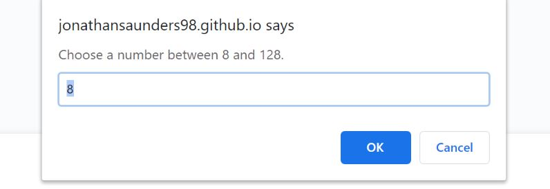
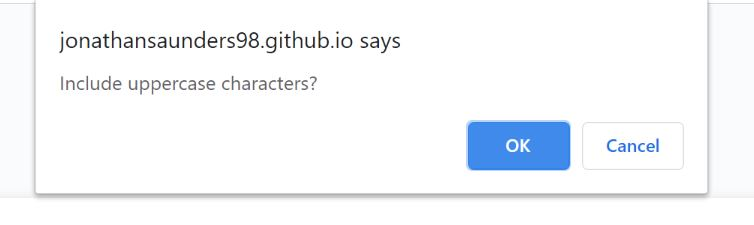
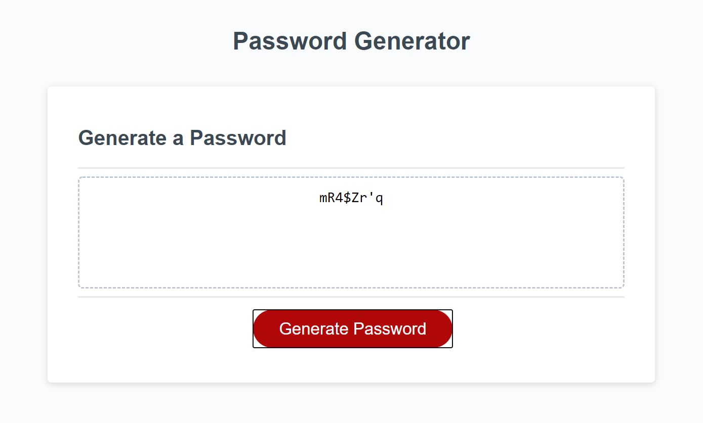

# Password-Generator-JS

## How it works
When the Generate button is clicked, a prompt to input a password length between 8 and 128 appears.  

Next, the user clicks through a series of confirm prompts to decide what type of characters are to be used.  

Finally, using Math.random and for loops, a random password is generated based off of the users choices.  

## Languages used
This pages runs off of HTML, CSS and JavaScript.  

https://jonathansaunders98.github.io/Password-Generator-JS/

